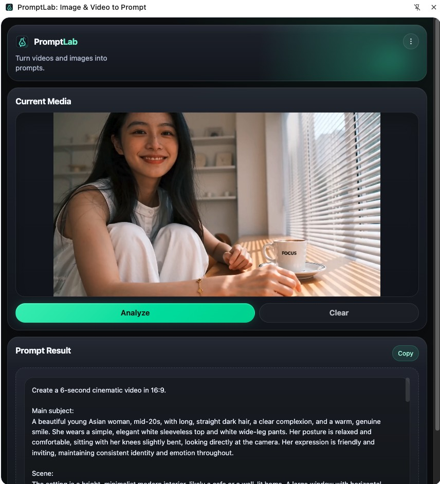
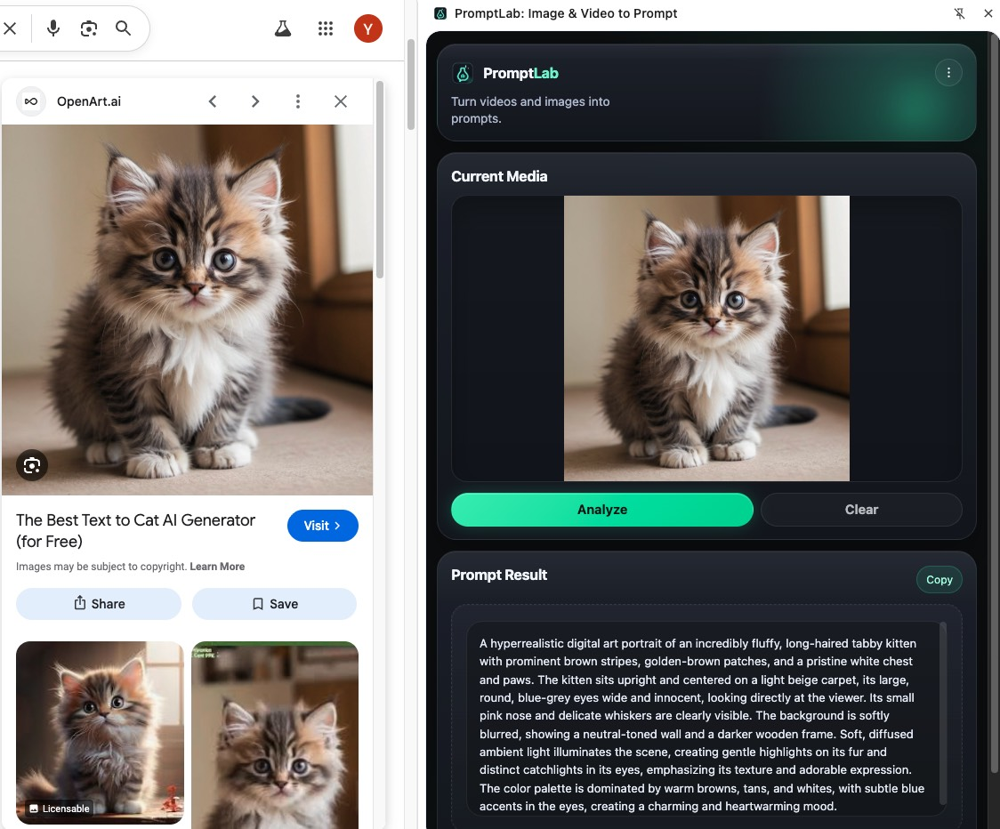
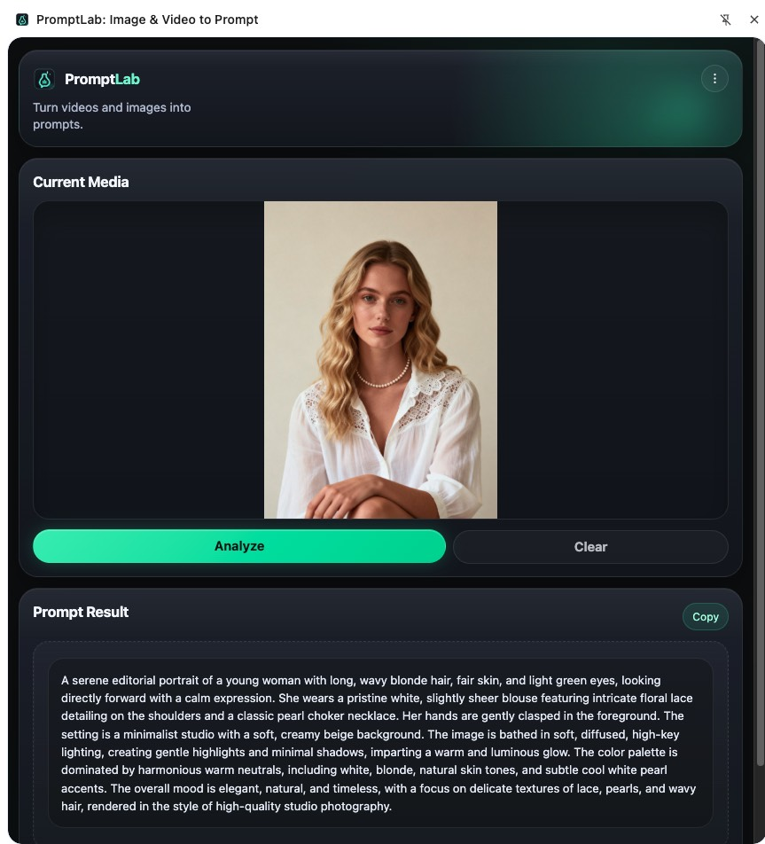
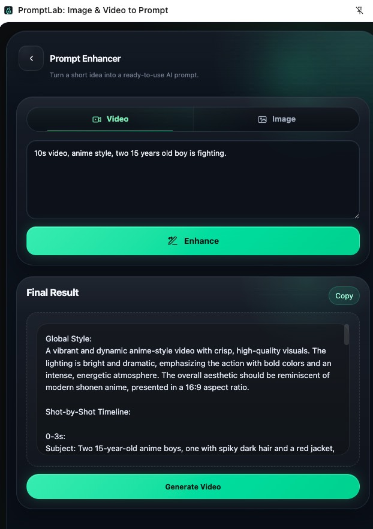

# PromptLab: Image & Video to Prompt

Turn local videos, web/local images, and short ideas into ready-to-use AI prompts.

PromptLab is a Chrome extension for AI creators, prompt learners, visual reference study, and short video prompt reverse engineering. It helps you turn local video files, web images, local image files, and short creative ideas into clean prompts you can copy and use.

## 🎬 Table of Contents

- [What Is PromptLab?](#what-is-promptlab)
- [What Can PromptLab Do?](#what-can-promptlab-do)
- [Installation](#installation)
- [How to Get Free Gemini API Key?](#how-to-get-free-gemini-api-key)
- [API Key Privacy](#api-key-privacy)
- [Settings](#settings)
- [Video Frame Sampling](#video-frame-sampling)
- [Image Prompt Logic](#image-prompt-logic)
- [Video Prompt Logic](#video-prompt-logic)
- [Current Limitations](#current-limitations)
- [Privacy](#privacy)
- [Roadmap](#roadmap)
- [License](#license)

## What Is PromptLab?

PromptLab is a Chrome extension that turns local videos, web images, local image files, and short ideas into ready-to-use AI prompts. It is made for AI creators, prompt learners, visual reference study, and short video prompt reverse engineering.

PromptLab does not currently support full online video analysis from platforms like Instagram, TikTok, X, Facebook, or YouTube.

For video analysis, please upload a local video file.

## What Can PromptLab Do?

### Local Video to Prompt



Upload a local video file. PromptLab samples key frames and turns them into one clean Final Result prompt.

- Best for short local videos under 60 seconds
- Extracts key frames automatically
- Designed for short creative videos, AI videos, ads, reels, and cinematic clips
- Default frame sampling mode: Standard
- Supports Fast / Standard / Detailed frame sampling modes

### Web Image to Prompt



Right-click a web image. PromptLab reads the image and creates a ready-to-use image prompt.

- Uses a dedicated image prompt template
- Outputs one clean Final Result prompt
- Optimized for image generation and visual recreation

### Local Image to Prompt



Upload a local image file. PromptLab uses an image-focused template to create one final prompt for image generation.

- Uses the same image-oriented output style as web image analysis
- Outputs one clean Final Result prompt
- Built for image generation and visual recreation

### Prompt Enhancer



Turn a short idea into a fuller prompt that is easier to copy and use.

- Includes a Video Prompt mode and an Image Prompt mode
- Video Prompt expands a short idea into a Seedance 2.0-style video prompt
- Image Prompt expands a short idea into a general image generation prompt
- Uses one clean Final Result output
- Works as an optional helper tool alongside the main image and video workflows

### Prompt History

- Automatically saves recent generation records
- Keeps up to 20 recent records

### Simple Output

- One unified result: Final Result
- No long analysis report
- No unnecessary labels like "Image Prompt:" or "Analysis:"
- Copy and use directly

## Installation

### Option 1: Install from Download ZIP, recommended for most users

1. Click Code -> Download ZIP on GitHub.
2. Unzip the file.
3. Open Chrome and go to `chrome://extensions/`.
4. Turn on Developer mode.
5. Click Load unpacked.
6. Select the `dist/` folder.

Important:

- Select `dist/`
- Do not select the project root folder
- Do not select `src/`
- Do not select `assets/`

If there is no `dist/` folder in the downloaded ZIP, use Option 2 to build it manually.

After the extension loads, open Settings and add your Gemini API Key.

### Option 2: Build manually

1. Clone or download this repository.
2. Open Terminal in the project folder.
3. Run:

```bash
npm install
npm run build
```

4. After build finishes, open Chrome and go to `chrome://extensions/`.
5. Turn on Developer mode.
6. Click Load unpacked.
7. Select the generated `dist/` folder.

After the extension loads, open Settings and add your Gemini API Key.

## How to Get Free Gemini API Key?

PromptLab uses your own Gemini API Key.

You can get a Gemini API Key from Google AI Studio:

https://aistudio.google.com/

After you install the extension, open Settings and paste your Gemini API Key.

## API Key Privacy

Your Gemini API Key is stored locally in your browser extension storage.

The project developer cannot see, collect, or access your API Key.

Images, video frames, and prompts may be sent to Gemini for analysis based on your Gemini API usage.

If you are worried about API usage or accidental exposure, you can set a daily API usage limit in Google AI Studio or Gemini settings.

## Settings

### Gemini API Key

Required. Used to send image or video frame analysis requests to Gemini.

### Frame Sampling Mode

This setting only applies to local video analysis.

Default mode: Standard

Available modes:

- Fast
- Standard
- Detailed

Fast:

- Fewer frames
- Faster analysis
- Best for quick prompt generation

Standard:

- Default recommended mode
- Balanced speed and prompt quality
- Best for most local videos

Detailed:

- More frames
- Better for complex motion, transitions, ads, and AI showcase videos
- Slower and may use more API resources

Image analysis does not use frame sampling settings.

## Video Frame Sampling

Fast:

- 5 frames
- 0%, 25%, 50%, 75%, 95%

Standard:

- duration <= 10s: 6 frames
- 10s < duration <= 30s: 10 frames
- 30s < duration <= 60s: 14 frames
- duration > 60s: 16 frames

Detailed:

- duration <= 10s: 10 frames
- 10s < duration <= 30s: 16 frames
- 30s < duration <= 60s: 24 frames
- duration > 60s: 32 frames

PromptLab samples from 0% to 95% of the video duration. It avoids 100% to reduce the chance of black frames or seek errors.

## Image Prompt Logic

Image analysis uses its own image-oriented prompt template.

It focuses on:

- Subject
- Scene
- Composition
- Style
- Lighting
- Color palette
- Mood
- Texture
- Material
- Perspective
- Visual quality
- Image generation keywords

## Video Prompt Logic

Video analysis uses a video-oriented prompt template.

The final result is written in a **Seedance 2.0-style prompt format**, focusing on clear subject description, action details, camera language, motion continuity, and cinematic scene structure.

Although the output is designed around Seedance 2.0-style prompting, it can also be used as a strong reference prompt for other AI video generation models. You may adjust the wording based on the model you use.

**Read More**:[Seedance 2.0 Prompt Library](https://github.com/gracech0322-cmd/seedance-2-prompt-library)

It focuses on:

- Subject
- Scene
- Action
- Camera language
- Motion
- Pacing
- Visual continuity
- Cinematic structure
- AI video generation style

## Current Limitations

PromptLab does not support:

- Instagram video extraction
- TikTok video extraction
- X / Twitter video extraction
- Facebook video extraction
- YouTube video extraction
- DRM or protected video extraction
- m3u8 video downloading
- Streaming video parsing

For best video results, upload a local video file.

## Privacy

PromptLab uses your own Gemini API Key.

Your API Key is stored locally in browser extension storage.

The developer cannot access your API Key.

Depending on your Gemini API usage, images, video frames, and prompts may be sent to Gemini for analysis.

Do not analyze private, sensitive, or copyrighted content unless you have permission.

You can set a daily API usage limit in Google AI Studio.

## Roadmap

- [x] Local video to prompt
- [x] Web image to prompt
- [x] Local image to prompt
- [x] Fast / Standard / Detailed video frame sampling
- [x] Prompt history, up to 20 records

Planned:

- [ ] Better image source fallback
- [ ] Prompt style presets
- [ ] Batch image analysis
- [ ] Direct video URL import
- [ ] Optional online video visible segment capture

## License

This project is licensed under the MIT License.

The PromptLab name, logo, and branding assets are not included in the MIT License and may not be used without permission.
